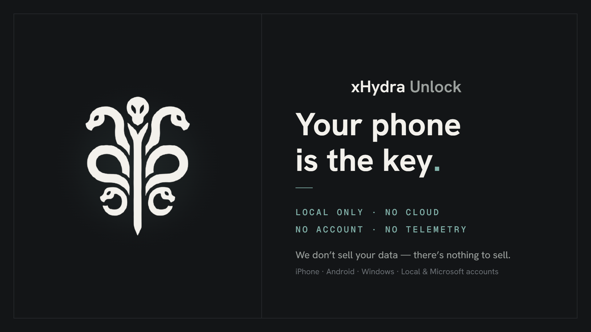

# xHydra Unlock Releases

This is the official public binary-release repository for **xHydra Unlock**. It is the
authoritative location for published Windows installers, release notes, SHA-256
checksums, public feedback, and security-reporting guidance.

The xHydra Unlock product source code is currently private. This repository intentionally
contains release information and distribution artifacts only; it does not contain the
private product source.

## Current release

**Windows companion: xHydra Unlock 1.1.0**

- [Download xHydra Unlock 1.1.0 for Windows](https://github.com/TahaHydra/XHydra-unlock-release/releases/download/v1.1.0/xHydraUnlock-1.1.0.msi)
- [Read the 1.1.0 release notes](https://github.com/TahaHydra/XHydra-unlock-release/releases/tag/v1.1.0)
- [Download the SHA-256 checksum](https://github.com/TahaHydra/XHydra-unlock-release/releases/download/v1.1.0/xHydraUnlock-1.1.0.sha256.txt)

Published SHA-256:

```text
C98BDF5E4F5D7DC2EB69C8E66ED458FD815C74559920889033D122F3CEC78DE1  xHydraUnlock-1.1.0.msi
```

Verify a downloaded copy in PowerShell:

```powershell
Get-FileHash .\xHydraUnlock-1.1.0.msi -Algorithm SHA256
```

The MSI is the complete Windows installer and is distributed directly rather than
wrapped in an additional ZIP archive.

> **Windows signing notice:** 1.1.0 is not currently signed with a publicly trusted
> Authenticode certificate. Windows SmartScreen may therefore show an **Unknown publisher**
> warning. Download xHydra Unlock only from the official xHydra website or this GitHub
> release and verify the SHA-256 checksum above.

## About xHydra Unlock

xHydra Unlock is a Windows 10/11 companion system that lets a paired iPhone or Android
phone approve a Windows unlock and perform authorized PC actions.

Version 1.1.0 adds:

- PC controls for **Lock, Sleep, Restart, and Shut down**;
- **Wake-on-LAN** support;
- a redesigned Windows companion;
- improved pairing and paired-PC management;
- OS device-authentication fallback when biometrics are unavailable;
- separate opt-in VPN permissions for unlock and PC controls; and
- reliability and security hardening across the Windows and mobile components.

The Windows companion is public here. The Android and iPhone apps are distributed through
their respective mobile testing/store channels rather than as binaries in this repository.

## Security model

xHydra Unlock is designed to stay local-first:

- no xHydra cloud account is required for the core unlock flow;
- no cloud unlock relay is used;
- no xHydra telemetry is required for the core product;
- LAN operation is the default;
- private VPN access is explicitly opt-in;
- Public Windows network profiles remain blocked;
- every privileged phone action requires OS-level device authentication;
- mobile signing keys are hardware-backed where the platform supports it;
- the paired PC is authenticated with pinned TLS identity;
- unlock/control requests use fresh challenges with replay protection; and
- the Windows credential remains encrypted locally on the PC and is never stored on the
  phone.

For vulnerability reporting and release-integrity guidance, see
[SECURITY.md](SECURITY.md).

## Official links

- Website: [xhydra.fr](https://xhydra.fr)
- Product page: [xHydra Unlock](https://xhydra.fr/products/xhydra-unlock)
- Releases: [GitHub Releases](https://github.com/TahaHydra/XHydra-unlock-release/releases)
- Feedback: [Report a bug or suggest a feature](https://github.com/TahaHydra/XHydra-unlock-release/issues/new/choose)

## Feedback

Use the public issue forms for normal bugs and feature requests. Include the affected
version, reproduction steps, and expected versus actual behavior.

Never attach passwords, pairing QR codes, private keys, purchase tokens, credential
blobs, or unredacted logs.

For a security vulnerability, **do not open a public issue**. Follow
[SECURITY.md](SECURITY.md).

## Previous releases

Older releases remain available from the
[GitHub Releases page](https://github.com/TahaHydra/XHydra-unlock-release/releases).

The previous Windows release was
[xHydra Unlock 1.0.0](https://github.com/TahaHydra/XHydra-unlock-release/releases/tag/v1.0.0).

## Release artifact policy

Public binaries are attached to GitHub Releases rather than committed into this
repository's git history. See [`releases/README.md`](releases/README.md) for the
artifact policy and verification guidance.
